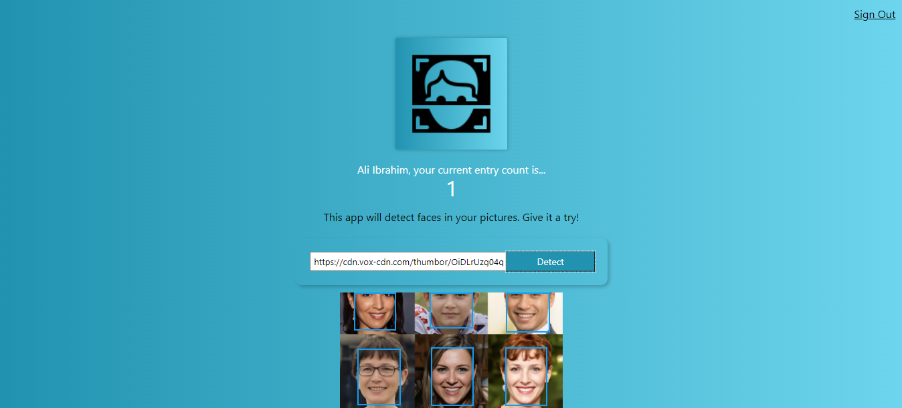

## A fully functional fullstack web application that can detect multiple faces.

<h2 align="center">
  
   
</h2>

### Built with

⚡️ HTML&CSS\
⚡️ React.js\
⚡️ Node.js/Express.js\
⚡️ PostgreSQL

### NPM Packages

- Create-React-App
- Tachyons
- react-tilt
- particles.js
- Bcrypt
- Postgresql
- Knex
- Body parser
- Cors
- Express

### Hosted/Deployed on

⚡️ Heroku

To view demo: [click here.](https://face-recog-application.herokuapp.com/)
